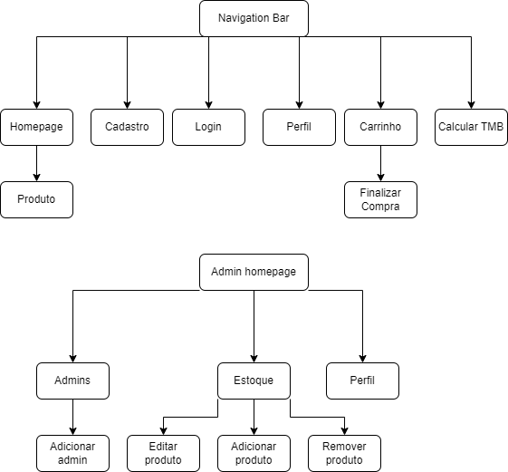

# Gear Nutrition

Project to course SCC0219 - Introduction to web development at USP

O tema escolhido para desenvolver o website foi uma e-commerce de suplementos com uma temática baseada no anima/mangá One Piece.

AVISO: Esse é um projeto realizado para fins educativos e tem problemas graves de segurança.

### Autores
- Gabriel Alves Kuabara - nUSP 11275043
- Victor Henrique de Sa Silva - nUSP 11795759
- Fernando Henrique Paes Generich - nUSP 11795342

## Requisitos

O sistema contém 2 tipos de usuários: clientes e administradores.

**Clientes** são aqueles que compram os produtos. Esses são registrados com as informações de CPF, nome, endereço, número de celular e email.

**Administradores** são responsáveis por registrar e gerenciar outros administradores, clientes e produtos. A aplicação já vem como padrão um usuário *admin* e senha *admin*. Cada administrador tem informações de CPF, nome, número de celular e email.

Os **produtos** contém um código de identificação, nome, foto, descrição, preço, quantidade em estoque e quantidade já vendida.

Sobre a **venda**, os produtos selecionados são adicionados ao carrinho na quantidade especificada. Uma venda pode ser efetuada através de um número de cartão de crédito (qualquer número é aceito pelo sistema). A quantidade comprada é subtraída do estoque e adicionada a quantidade vendida. Somente quando uma compra é efetuada ou o usuário excluí os itens, que o carrinho é esvaziado.

Sobre o **gerenciamento de produtos**, os administradores podem criar, atualizar, ver e deletar produtos.

Como **funcionalidade** extra, criaremos

O sistema é responsivo e visa uma boa acessibilidade e usabilidade para seus usuários.

## Descrição do Projeto

Gear Nutrition é um site com temática do famoso anime/manga One Piece, que vende suplementos destinados ao consumo por atletas para alta performance esportiva. 

Implementado em HTML, CSS, JavaScript.

Diagrama de navegação:

As imagens do mockup estão na pasta `/mockup`.

### Funcionalidades

Sobre as funcionalidades planejadas para o website:
- Cadastro usando email e senha, assim como login.
- Visualização das informações do cliente, com opção de alterar cadastro.
- Página de administrador capaz de alterar, adicionar e remover dados da loja.
- Homepage com categorias e produtos visando acessibilidade.
- Página de cada produto com todas as informações necessárias e possibilidade de adicionar ao carrinho.
- Acesso ao carrinho de compras, sendo possível alterar quantidades dos produtos selecionados e proseguir com a finalização da compra.
- Adicionar cartão de crédito/débito.
- Seleção de endereço de entrega.
- Algo ai.

### Servidor

As informações que devemos salvar são:
Usuários:
- Id (chave única para cliente)
- Nome
- Email
- Senha
- Campo booleano para indicar administrador
- CPF
- Endereço
- Número de telefone

Produtos:
- Id (chave única para produto)
- Nome
- Categoria (0 a 2)
- Preço
- Descrição
- Identificador da Imagem
- Quantidade vendida do produto
- Quantidade em estoque

## Comentários Sobre o Código
## Plano de Teste
## Resultado dos Testes
## Building
## Problemas
## Comentários